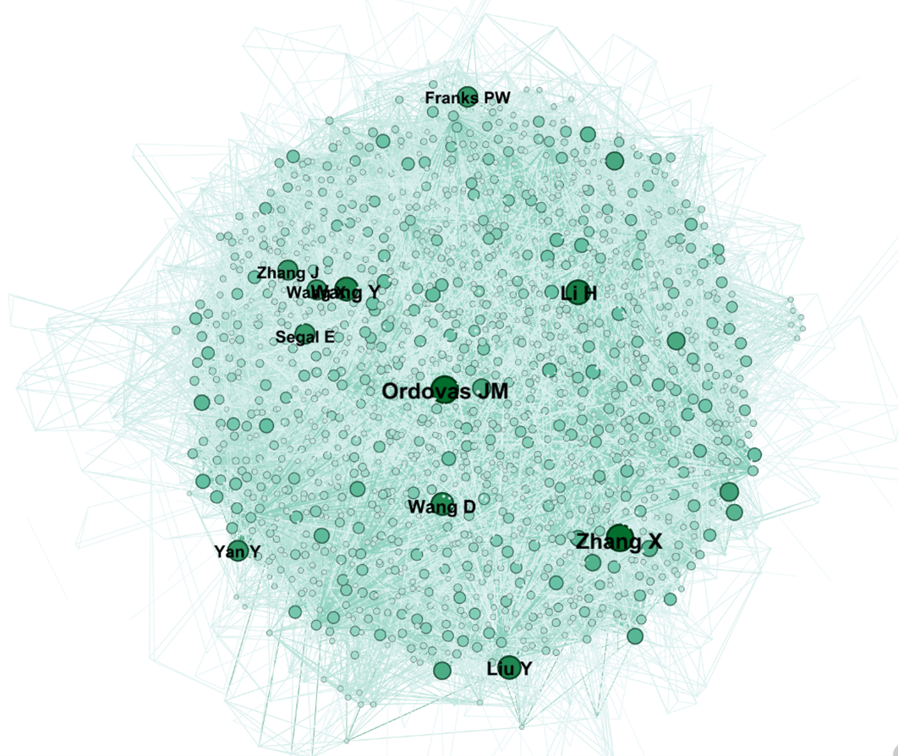
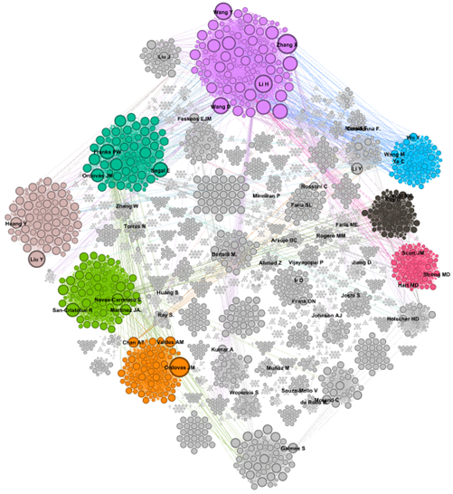
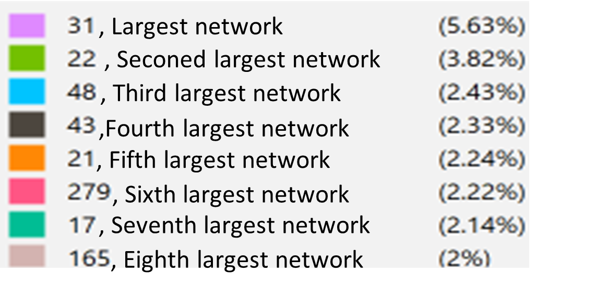

# Co-authorship Network Analysis of Nutrigenomics Research

A Social Network Analysis of the nutrigenomics research community using
PubMed publication data, Python, NetworkX, and Gephi.

---

## Overview

This project investigates the structure of scientific collaboration in
the field of nutrigenomics through co-authorship network analysis.

The study uses publication data collected from PubMed between 2020 and
2024 and models relationships between researchers based on their
co-authorship of scientific publications.

The analysis combines:

- Data collection and preprocessing
- Bipartite network construction
- One-mode author network projection
- Macro-level Social Network Analysis
- Micro-level centrality analysis
- K-core analysis
- Community detection
- Network visualization using Gephi

The goal is to understand both the overall structure of the research
community and the structural position of individual researchers.

---

## Research Question

The main question addressed by this project is:

How is the research collaboration network in nutrigenomics structured, and which researchers and communities occupy important positions within the network?

The analysis examines the network from two complementary perspectives:

Macro-level: overall structure and organization of the network
Micro-level: position and importance of individual researchers

---

## Data

The publication data were collected from PubMed and cover publications
from 2020 to 2024.

The search strategy included the following concepts:

- Nutrigenomics
- Nutritional genomics
- Gene-based diet
- Precision nutrition

The resulting dataset contains publication-level metadata including:

- PMID
- Title
- Authors
- First Author
- Journal/Book
- Publication Year
- Create Date
- PMCID
- NIHMS ID
- DOI

The dataset used in this repository is available at:

`data/nutrigenomics-pubmed.csv`

---

## Data Preparation

The original publication data were exported from PubMed as a CSV file.

Records with missing author information were removed before constructing
the collaboration network.

The cleaned publication data were then used to construct an author–
publication bipartite graph.

---

## From Publications to a Co-authorship Network

The analysis uses two complementary network representations.

### 1. Bipartite Author–Publication Network

The first network is a bipartite graph containing two types of nodes:

- Authors
- PubMed publication IDs (PMIDs)

An edge connects an author to a publication when the author contributed
to that publication.

This representation preserves the relationship between researchers
and the publications to which they contributed.

### 2. One-Mode Author Network

The bipartite network is subsequently projected into a one-mode
author–author network.

In this network:

- Each node represents an author.
- Each edge represents a co-authorship relationship.
- Two authors are connected when they have co-authored at least one
  publication.

This author network forms the basis for the centrality, structural,
and community analyses.

---

## Analytical Framework

The project analyzes the network at two complementary levels.

### Macro-Level Analysis

Macro-level analysis examines the overall structure of the scientific
collaboration network.

The following measures are considered:

- Network Density
- Average Clustering Coefficient
- Modularity
- Diameter
- Average Path Length

These measures help characterize the overall connectivity, clustering,
and community structure of the research network.

### Micro-Level Analysis

Micro-level analysis focuses on the structural position of individual
researchers.

The project examines:

- Degree Centrality
- Betweenness Centrality
- Eigenvector Centrality
- Katz Centrality
- PageRank Centrality

Each measure captures a different aspect of an author's position within
the collaboration network.

---

## Centrality Measures

### Degree Centrality

Degree centrality represents the number of direct co-authorship
connections of an author.

Authors with higher degree centrality have collaborated with a larger
number of researchers within the network.

### Betweenness Centrality

Betweenness centrality measures how frequently a researcher lies on
shortest paths between other researchers.

Researchers with high betweenness can occupy intermediary or bridge
positions within the network.

### Eigenvector Centrality

Eigenvector centrality considers not only the number of connections
but also the importance of the researchers to whom an author is
connected.

### Katz Centrality

Katz centrality extends the analysis beyond immediate connections by
considering paths through the wider network.

It can therefore capture influence resulting from both direct and
indirect relationships.

### PageRank

PageRank evaluates the structural importance of researchers by
considering both their connections and the importance of the researchers
to whom they are connected.

---

## Network Structure

The final co-authorship network contained:

**4,901 independent authors**

The study reported the following network characteristics:

| Metric | Result |
|---|---:|
| Number of authors | 4,901 |
| Average authors per paper | 10.615 |
| Network density | 0.002 |
| Average clustering coefficient | 0.951 |
| Number of triangles | 114,890 |
| Diameter | 18 |
| Average path length | ~6.2 |
| Modularity | 0.960 |
| Number of communities | 424 |

The high clustering coefficient indicates strong local clustering among
groups of collaborating researchers, while the relatively low density
indicates that only a small proportion of all theoretically possible
author-to-author connections are present.

---

## Key Researchers

Different centrality measures highlight different structural roles.

### Degree Centrality

The study identified:

- Ordovas JM
- Zhang X
- Li H

among the authors with the highest degree centrality.

### Betweenness Centrality

The highest betweenness centrality values were associated with:

- Ordovas JM
- Chan AT
- Yan Y

These researchers occupy important intermediary positions within the
network.

### PageRank

The highest PageRank values were reported for:

- Wang Y
- Ordovas JM
- Zhang X
- Chen Y
- Li Z

The results demonstrate why multiple centrality measures are useful:
different metrics identify different dimensions of structural
importance.

---

## K-Core Analysis

A k-core analysis was applied to the author–publication network to
focus on the more densely connected core of the collaboration structure.

A threshold of:

`k = 5`

was used.

The k-core visualization removes nodes with fewer than five relevant
connections and provides a more focused view of the core collaborative
structure.

The resulting visualization is available in:

`results/figures/kcore-network.png`

---

## Community Detection

Community detection was used to identify groups of researchers with
stronger internal collaboration patterns.

The network exhibited a highly modular structure:

**Modularity = 0.960**

A total of:

**424 communities**

were identified.

The largest community contained:

**276 authors (5.63%)**

while the second-largest community contained:

**187 authors (3.82%)**

The results indicate that researchers tend to collaborate more strongly
within particular groups or research communities than across the entire
network.

---

## Community Structure

The largest communities were visualized using different colors and
network layouts.

The analysis identified several major communities, including the
largest six communities representing more than 2% of the total network.

Community-level analysis was also used to examine leading researchers
within these groups based on degree centrality.

---

## Visual Results

### Top Authors Network

The network visualization highlights highly connected researchers within
the overall co-authorship network.

---

### Betweenness Centrality

This visualization highlights researchers occupying intermediary or
bridge positions within the collaboration network.

---

### PageRank Centrality

This visualization represents the network according to PageRank
centrality and highlights structurally important researchers.

---

### Bipartite Author–Publication Network

This visualization shows the two-mode structure connecting authors with
their publications.

---

### K-Core Network

The k-core visualization focuses on the densely connected core of the
collaboration network using a threshold of k = 5.

---

### Research Communities

The community analysis reveals distinct groups of researchers within the
overall nutrigenomics collaboration network.

A complementary visualization provides another view of the community
structure and the relative size of the major subnetworks.

---

## Tools & Technologies

### Programming & Analysis

- Python
- Pandas
- NetworkX
- Jupyter Notebook

### Network Visualization

- Gephi

### Data Source

- PubMed

---

## Publication

This project is associated with the following publication:

Khasha, R., Haghshenas, M., Sarikhani, S., & Saeidi, F. (2025).

**Co-authorship Network Analysis of Nutrigenomics Research Using Micro- and Macro-level Social Network Analysis.**

*Journal of Industrial and Systems Engineering*, e232606.

---

