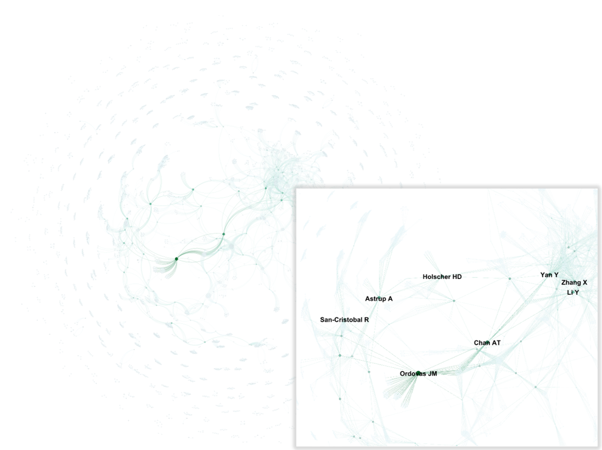
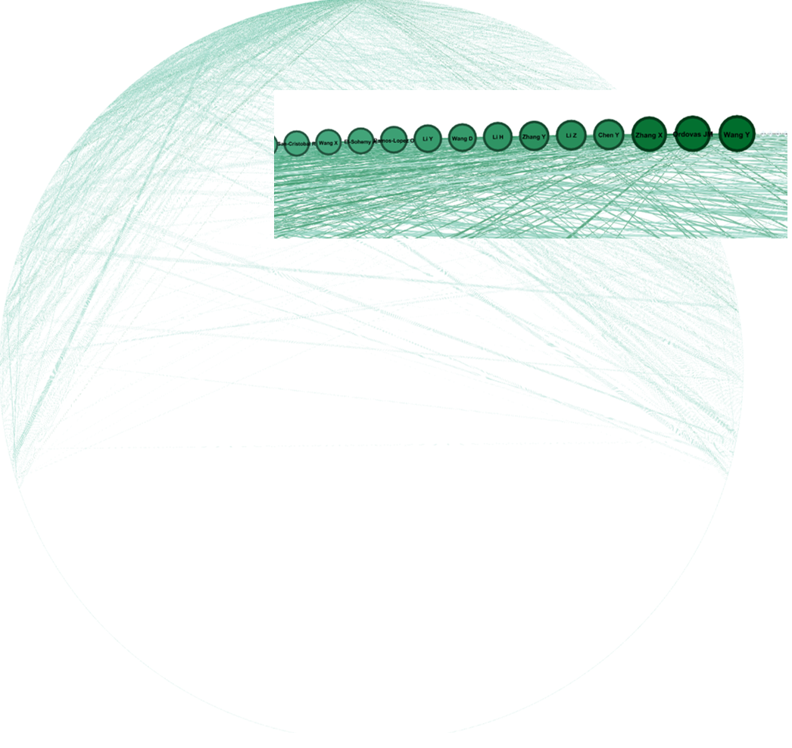
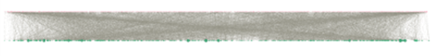
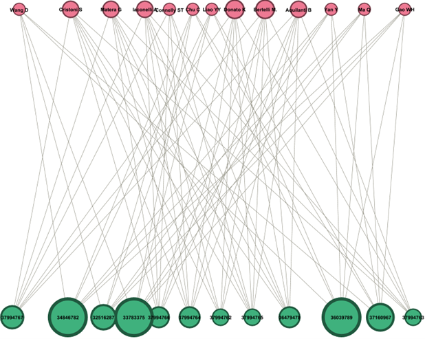

# Results

This folder contains the main visual outputs of the nutrigenomics
co-authorship network analysis.

The results are organized around two levels of analysis:

- Micro-level network analysis
- Macro-level network analysis

## Micro-Level Analysis

Micro-level analysis examines the position and importance of individual
authors within the collaboration network.

### Degree Centrality

Degree centrality identifies authors with a large number of direct
co-authorship connections.

### Betweenness Centrality

Betweenness centrality highlights authors that occupy intermediary or
bridge positions between other researchers.

### Eigenvector Centrality

Eigenvector centrality considers the importance of an author's connections
to other influential authors.

### PageRank Centrality

PageRank is used to examine author influence while accounting for the
structure and importance of connections.

## Macro-Level Analysis

Macro-level analysis examines the overall structure of the collaboration
network.

### Bipartite Author–Publication Network

The bipartite network represents relationships between authors and
publications.

### K-Core Network

A k-core analysis was used to examine the densely connected core of the
co-authorship network.

### Research Communities

Community detection was used to identify groups of authors with stronger
internal collaboration patterns.

## Key Network Findings

The study identified 4,901 authors in the analyzed co-authorship network.

The network exhibited:

- Density: 0.002
- Average clustering coefficient: 0.951
- Diameter: 18
- Average path length: approximately 6.2
- Modularity: 0.960
- Number of detected communities: 424

The largest detected community contained 276 authors, while the second
largest contained 187 authors.

These results illustrate a highly structured collaboration network with
distinct research communities.
